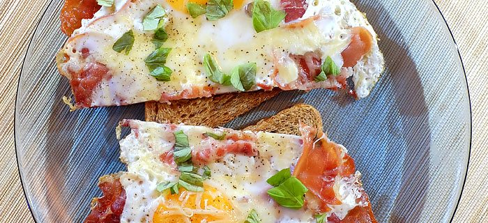

# recept voor perfecte ei

1. Pak eieren, bacon, een pan en zet de pan op het fornuis.
2. Doe de pan aan.
3. Doe de bacon in de pan en laat bakken op 40% hitte voor 30-40 seconden.
4. Draai de bacon om.
5. Breek de eier dooier en doe het ei in de pan.
6. Laat het ongv op 65% hitte bakken voor ongv 1 min.
7. Draai het ei om en doe er stukjes kaas op.
8. Laat dit op 20% hitte bakken voor 1-1.5 mins.
9. Eet smakelijk.

